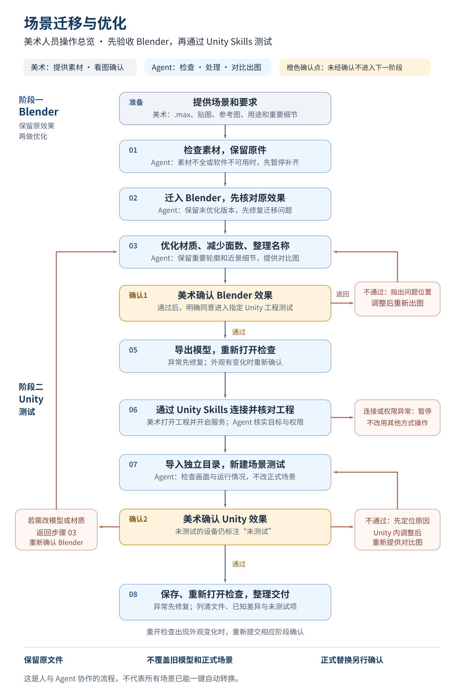

# 场景迁移与优化：美术操作流程

第一次使用推荐 [六步可视化HTML](场景迁移与优化-六步指南.html) 与 [同内容Markdown](场景迁移与优化-六步指南.md)。本页是详细补充版：原八步中的迁移与优化合为第03步，Blender确认与导出检查合为第04步，Unity连接与测试合为第05步，最终确认和交付合为第06步。安全边界不变。

适用情况：拿到一份 `.max` 场景，希望迁入 Blender 整理优化，确认效果后，再通过 Unity Skills 导入指定 Unity 工程进行测试。

**您负责提供素材、说明要求、看图和确认。Agent 负责检查、处理、出图和记录。您不需要写代码或输入命令。**

这是一份协作流程，不是已经具备所有功能的一键转换软件。不同场景可能需要单独处理；遇到缺失素材、无法读取的材质或操作能力不足，Agent 应说明问题并暂停，不能假装完成。

## 先看总流程

[单独打开流程图](图示/场景迁移与优化-流程图.svg)。可用浏览器打开并放大；蓝色步骤由 Agent 处理，橙色步骤需要您看图确认。若软件不显示图，继续阅读下方的分步说明。

记住两句话：**Blender 没确认，不进入 Unity；Unity 测试通过，也不自动替换正式场景。**

## 第一次使用：先把工作环境准备好

- 请 Agent 检查这台电脑是否能使用 3ds Max 和 Blender；缺少软件、插件或使用权限时，由 Agent 列出需要补齐的内容，不擅自安装或购买。
- 提前说明模型最终在哪个 Unity 工程和什么设备上使用，避免做完后才发现效果不适合。此时不需要连接 Unity。
- Unity 导入阶段需要目标工程已具备 Unity Skills，Agent 也需要相应操作能力。它们不包含在本工具包中；缺少时先请 Agent 说明准备方式。
- 连接和操作以实际可用权限为准。软件或技能不可用时，保留已完成的结果，不要求您自行写程序解决。

## 每次拿到新场景：把这张资料卡发给 Agent

不清楚的项目可以填写“不清楚，请帮我检查”，不要随意猜数字。

| 需要提供 | 填写示例或说明 |
|---|---|
| 场景名称 | 本次任务的名称 |
| `.max` 文件位置 | 把文件或所在文件夹交给 Agent |
| 贴图及配套资源 | 尽量提供完整素材文件夹，不要只发 `.max` |
| 原效果参考 | 原渲染图、截图或可正常打开的原场景；没有就明确说明 |
| 最终用途和设备 | 电脑展示、手机或头显等 |
| 观看方式 | 是否进入室内、是否近看人物和文字 |
| 必须保留 | 例如人物面部、展板文字、重要装饰、独立零件 |
| 允许调整 | 例如减少远处物件细节；不允许改整体颜色和风格 |
| 其他需求 | 是否需要动画、碰撞或交互拆分；不需要的不要默认添加 |
| 目标 Unity 工程 | 工程名称及位置；连接在 Blender 确认后进行 |

### 直接复制：开始新任务

> 请阅读《场景迁移与优化-美术操作流程》和《场景迁移与优化-Agent执行约定》，按资料卡检查这份场景。先说明素材是否完整、软件是否可用、哪些地方可能无法还原，再给我处理方案。不要覆盖原文件，不要提前连接 Unity，也不要安装或购买软件。请用美术能理解的语言说明，不要求我输入命令。

## 第一步：检查素材并保留原件

**您要做：** 提供资料卡，确认缺少的素材如何处理，以及 Agent 提出的处理范围。

**Agent 会做：** 核对场景和贴图，检查原文件能否安全读取，保留原件并建立独立工作副本。列出缺失贴图、打不开的材质、异常模型等问题。

**进入下一步前：** 缺失问题已解决，或您明确接受某项替代方案。没有原效果参考时，后续只能判断是否满足您的要求，不能宣称与原场景完全一致。

> 我同意刚才列出的处理方案。请只在独立副本中工作，保留原文件；未确认的新问题先告诉我。先完成 Blender 迁移和优化，不连接 Unity。

## 第二步：迁入 Blender，先检查未优化效果

**您要做：** 查看 Agent 提供的原效果与 Blender 对比；指出缺失、位置、颜色和外观问题。

**Agent 会做：** 先保留一份未减面的 Blender 版本，检查模型完整性、尺寸、位置、贴图和材质。先修复迁移问题，再进行优化，避免分不清问题来自哪里。

**进入下一步前：** 已建立可对照的未优化版本。出现明显差异时先处理，不通过调亮画面或降低截图清晰度掩盖问题。

> 请先展示未优化版本与参考效果的同角度对比，重点检查人物、文字、玻璃、金属和内部空间。有无法还原的地方，请单独标出来。

## 第三步：整理材质、减少面数、统一名称

**您要做：** 确认必须保留的细节，以及是否允许对原来的颜色或风格进行调整。

**Agent 会做：** 在新版本中减少不必要的细节、合理处理贴图和材质，整理物体、材质及图片名称，并保留旧名称对应关系。先试一小部分，确认效果后再扩大处理。

**默认不做：** 改变整体配色、替换人物、随意合并所有零件、把全场模型按同一比例减面。

“材质优化”默认是让显示更正确、使用更合适，不等于重新设计美术风格。运行是否流畅、文件是否变小和画面是否清晰，需要分别检查。

> 请在保留未优化版本的前提下优化。重要轮廓、人物面部和文字优先保留，近看不能明显模糊。不要改变整体风格；请给我处理前后的同角度对比。

## 第四步：您确认 Blender 效果

**Agent 应提供：** 全景、四周、重要近景及内部视角；画面标明版本、位置和已知问题。工程保存后重新打开，确认贴图和材质仍然完整。

请逐项检查：

- [ ] 模型没有缺失、错位或不该出现的变形。
- [ ] 人物、文字和重要轮廓保持清楚。
- [ ] 贴图没有丢失、拉伸或明显模糊。
- [ ] 玻璃、金属和其他重要材质符合要求。
- [ ] 内部、背面和实际观看距离下的效果正常。
- [ ] 已知差异已说明，我接受这些差异。

**不通过：** 用截图圈出位置，说明“哪里不对、希望怎样”，让 Agent 调整后重新出图。

> 这个版本暂不通过。问题在【截图和位置】，我希望【具体效果】。请调整并重新提供对比，不进入 Unity。

**通过：** 请明确确认版本，并授权下一阶段；“看起来可以”不应被扩大解释为可以替换业务资产。

> 我确认 Blender 的【版本名称】效果通过，接受已列明的差异。请检查导出文件，确认正常后，通过 Unity Skills 连接【目标工程】，导入独立目录并新建测试场景。不要覆盖旧模型或修改正式场景。

## 第五步：检查导出的模型

**您要做：** 通常只需等待检查结果；若外观发生变化，需要重新确认。

**Agent 会做：** 按目标 Unity 工程选择合适的模型文件形式，导出后重新打开，检查是否丢模型、贴图、材质或发生错位。

**进入下一步前：** 导出正常。发现问题先修复；修复改变外观时，重新进行 Blender 效果确认。不能只凭“文件已生成”进入 Unity。

> 请确认导出的模型重新打开后仍与我认可的版本一致。如有外观变化，先给我看，不要直接带入 Unity。

## 第六步：通过 Unity Skills 连接正确的工程

**您要做：** 打开目标 Unity 工程，保存正在编辑的内容，并确认 Unity Skills 已开启。需要时，将面板显示的连接信息或截图发给 Agent。

**Agent 会做：** 仅通过 Unity Skills 检查连接，核对工程名称和位置，并确认可以执行本次测试。发现未保存内容、项目错误、多个工程或权限不足时，先说明并等待处理。

**进入下一步前：** 确认连接的是您指定的工程，且不会影响正在进行的其他工作。

> 目标工程已打开。请通过 Unity Skills 连接，先把实际连接到的工程名称和位置告诉我。若不一致、无法连接或权限不足，请停止，不要改用其他方式操作。

## 第七步：新建 Unity 测试场景并看图

**Agent 会做：** 导入独立目录，新建测试场景，不覆盖旧模型、不改正式场景。先在简单灯光下检查模型，再按目标项目的效果检查，提供与 Blender 认可版本对应的视角。

请逐项检查：

- [ ] 大小、位置和朝向正确，物体没有散开。
- [ ] 没有粉色、全黑、透明异常或贴图丢失。
- [ ] 人物、文字、玻璃和金属等重点部位符合要求。
- [ ] 实际观看距离下，清晰度和整体观感正常。
- [ ] 与 Blender 的差异已解释，不能用灯光遮掩错误。
- [ ] 测试范围内的运行情况已说明；未测试设备明确标为“未测试”。

**不通过：** Agent 先判断原因。在 Unity 内调整的，重新出 Unity 对比图；需要修改 Blender 模型或材质的，返回前面的优化和确认步骤。

> Unity 版本暂不通过，问题在【位置】，表现为【现象】。请先定位原因；若要改 Blender 模型或材质，必须重新给我确认，不能悄悄换掉已认可的版本。

**通过：**

> 我确认 Unity 测试场景的【版本名称】画面通过。请保存并重新打开检查，整理交付。没有测试过的设备请注明；本次仍不授权替换正式场景中的旧模型。

## 第八步：接收最终文件

请 Agent 交付一个清晰的文件清单，并告诉您“哪个文件用于编辑、哪个用于导入、哪个用于看效果”。

- 未优化的 Blender 版本：用于对照和恢复。
- 已确认的 Blender 优化版本：用于继续编辑。
- 经过检查的导出模型：用于导入目标工程。
- Unity 测试场景及所需资源：注明所在工程和打开方式；不能只给一个缺少模型的场景文件。
- 原效果、Blender 和 Unity 的对比图。
- 简短说明：已完成、已接受的差异、未测试项和恢复方式。

Unity 测试场景不是独立应用程序。以后若要把它转移到另一个工程，或替换正式场景中的旧模型，需要单独安排检查。

## 什么时候必须暂停

| 遇到的情况 | 应怎样处理 |
|---|---|
| 缺贴图、缺插件或原文件打不开 | 列出缺少的东西，补齐或确认替代范围 |
| 重要细节被减掉、外观变差 | 回到保留版本调整，不强行判定通过 |
| Unity Skills 无法连接或连错工程 | 暂停，确认工程与连接信息，不绕过连接方式 |
| 当前软件能力或权限不足 | 清楚说明需要什么协助，不伪造结果 |
| 原文件或已确认版本又被修改 | 重新确认采用哪个版本，不混用旧截图 |
| 测试机器或设备不具备条件 | 保留“未测试”，不宣称流畅或全部通过 |

## 技术细节交给 Agent

美术人员读到这里即可。需要执行任务的 Agent 继续阅读 [Agent执行约定](../执行规范/场景迁移与优化-Agent执行约定.md) 和 [标准流程](../执行规范/三维场景转换与游戏优化-标准流程.md)。
